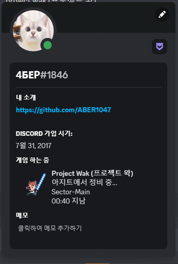
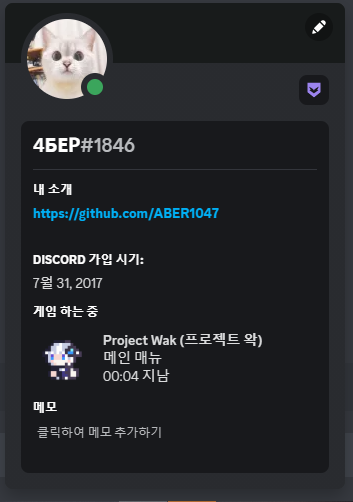
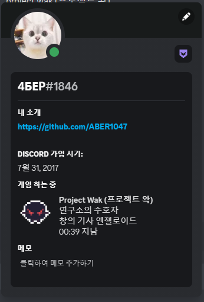

<div align="center">


</br></br>


#### - 총 다운로드 수


</br>

#### - 게임 다운로드 

[](https://github.com/ABER1047/Project-wak/releases/download/Alpha-1.4/project.wak_2023_01_12.zip)

</br></br>

#### - 디스코드 (채팅 금지 되어있음 [개발 일지용])

[](https://discord.gg/hzbCTRemqq)


</br></br></br></br></br></br>


#


스케일도 크게 제작했고 퀄리티도 좋고 비주얼도 굉장히 좋은거 같아서 개인적으로 젤 맘에 드는 프로젝트

유튜버 '우왁굳' 팬게임으로 제작함

1인 개발로 만들었고, 음악 빼고 그림부터 코드까지 싹다 혼자 작업함;;

완성 하기 전에 대략 100명 정도의 테스터들한테 베타테스트를 진행했음.

</br>

#

#### 2023-01-06 추가

##### 디스코드(Discord)에 게임 등록 완료!

##### 이제 게임 플레이시, 프로필에 게임 상태창이 활성화 됩니다!

  

#


##### (크레딧 및 코드 관련 설명글은 아래 참고)

</br></br></br>

</div>


<details>
<summary>아이템 위키</summary>


-----------------------

<details>
<summary>무기</summary>

-----------------------

#### 양손 광선검

가드 효율 0%</br>
특수 효과 : 익스플로전 사용 가능 및 매 100번째 타격 마다 강력한 '갈!' 데미지</br>


무기 강화 1레벨 이상시, 에네르기파 사용 가능</br>
'의문의 제단'에 붉은 광선검과 푸른 광선검을 바쳐 획득 가능</br>

</br></br>


#### 초록 광선검

가드 효율 10%</br>
특수 효과 : 일반 공격 공속 증가</br>


무기 강화 1레벨 이상시, 에네르기파 사용 가능</br>
'검성의 그림자' 처치시 획득 가능</br>

</br></br>


#### 붉은 광선검

가드 효율 10%</br>


무기 강화 1레벨 이상시, 에네르기파 사용 가능</br>
튜토리얼 스테이지에서 획득 가능</br>

</br></br>


#### 푸른 광선검

가드 효율 10%</br>
특수 효과 : 매 100번째 타격 마다 강력한 '갈!' 데미지</br>


무기 강화 1레벨 이상시, 에네르기파 사용 가능</br>
'검성의 그림자' 처치시 획득 가능</br>

</br></br>


#### 돌격 소총

가드 효율 -50%</br>
특수 효과 : A키를 사용한 공격만 가능, 총알 제한 없음, 적의 방어력을 무시한 고정 데미지 적용</br>


탈리스만 '객관안'과 함께 사용하면, 세트 효과 '자동 조준' 활성화</br>
'검성의 그림자' 처치시 획득 가능</br>

</br></br>


#### 지옥 참마도

가드 효율 20%</br>
특수 효과 : '할복' 사용 가능</br>


'할복' 사용 이후, 탈리스만 '아이네가 준 도끼'와 함께 사용하면 성능이 매우 좋아짐</br>
'검성의 그림자' 처치시 획득 가능</br>

</br></br>

---------------------------------

</details>


<details>
<summary>탈리스만</summary>

-----------------------

#### Re:wind 시계

특수 효과 : 게임 오버가 되었을 때, 바로 직전의 과거로 시간을 되돌림.</br>
또한, 현재 시각과 함께 왁드로이드 완성까지 남은 시간을 표시해줌.


아이네를 통해 획득 가능</br>

</br></br>


#### 객관안

특수 효과 : 자동으로 적을 타깃팅 해줌 (= 락온 효과)</br>


돌격 소총과 함께 사용하면 총을 모든 각도로 자동 조준함</br>
섹터 탐사를 통해 획득 가능 (숨겨진 아이템)</br>

</br></br>


#### 런닝 나시

특수 효과 : 대쉬 스킬 사용시 소모하는 스테미나량 50% 경감</br>


섹터 탐사를 통해 획득 가능 (숨겨진 아이템)</br>

</br></br>


#### 보라색 리본

특수 효과 : 방어력 10% 증가 및 최대 체력 50만큼 증가</br>


주르르를 통해 획득 가능</br>

</br></br>


#### 징버거

특수 효과 : 전투 모드가 아닌경우, 체력을 조금씩 회복</br>


징버거를 통해 획득 가능</br>

</br></br>


#### 파란 머리핀

특수 효과 : 방어력 10% 증가 및 최대 체력 50만큼 증가</br>


고세구를 통해 획득 가능</br>

</br></br>


#### 응원 깃발

특수 효과 : 기본 데미지 18% 증가</br>


섹터 탐사를 통해 획득 가능 (숨겨진 아이템)</br>

</br></br>


#### 알잘딱 가드

특수 효과 : 적에게 피격당할시, 70%확률로 자동 방어</br>


난이도 설정을 통해 획득 가능 (벨런스 보정 아이템)</br>

</br></br>


#### 아이돌 신발

특수 효과 : 점프력 증가 및 중력 감소</br>


해당 탈리스만을 이용하여 얻을 수 있는 특수 탈리스만들이 맵 곳곳에 존재함</br>
섹터 탐사를 통해 획득 가능 (숨겨진 아이템)</br>

</br></br>


#### 푸른색의 깃발

특수 효과 : 크리티컬 데미지 확률 15% 증가</br>


섹터 탐사를 통해 획득 가능 (숨겨진 아이템)</br>

</br></br>


#### 다이아몬드 검

특수 효과 : 크리티컬 데미지 확률 10% 및 기본 데미지 10% 증가</br>


비챤을 통해 획득 가능</br>

</br></br>


#### AED (심장 제세동기)

특수 효과 : 플레이어가 사망하였을때, 체력을 1만큼 남기고 즉시 부활</br>


릴파를 통해 획득 가능</br>

</br></br>


#### 뱅갈고무나무 에스트 병

특수 효과 : 최대 체력의 50%만큼 회복 및 상태 이상 해제</br>


사망 횟수가 10회를 넘었을시, 아이네를 통해 획득 가능 / 난이도 설정을 통해 획득 가능 (벨런스 보정 아이템)</br>

</br></br>

#### 각성제

특수 효과 : 사용 즉시 레이지 모드 발동 및 상태 이상 해제</br>


섹터 탐사를 통해 획득 가능 (숨겨진 아이템)</br>

</br></br>

#### 깨진 하트 크리스탈 (좌)

특수 효과 : 최대 체력 100만큼 증가</br>


섹터 탐사를 통해 획득 가능 (숨겨진 아이템)</br>

</br></br>


#### 깨진 하트 크리스탈 (우)

특수 효과 : 최대 체력 100만큼 증가</br>


섹터 탐사를 통해 획득 가능 (숨겨진 아이템)</br>

</br></br>


#### 하트 크리스탈

특수 효과 : 최대 체력 150만큼 증가</br>


난이도 설정을 통해 획득 가능 (벨런스 보정 아이템)</br>

</br></br>


#### 바다의 왕의 삼지창

특수 효과 : 레이지 게이지가 80% 이상 찬 경우, 공중에서 E키를 누를시, 강력한 특수 스킬 사용</br>


히든 보스 '왁귀상어'를 통해 획득 가능 (숨겨진 아이템)</br>

</br></br>


#### 1차 테스터 기념 동상

특수 효과 : 방어력 5%, 크리티컬 데미지 확률 12%, 기본 데미지 10% 증가</br>


닉네임 설정시, 1차 테스터 명단에 있는 닉네임으로 설정하여 획득 가능 (네이밍 치트 아이템)</br>

</br></br>


#### 2차 테스터 기념 동상

특수 효과 : 방어력 5%, 크리티컬 데미지 확률 12%, 기본 데미지 10% 증가</br>


닉네임 설정시, 2차 테스터 명단에 있는 닉네임으로 설정하여 획득 가능 (네이밍 치트 아이템)</br>

</br></br>


#### 3차 테스터 기념 동상

특수 효과 : 방어력 5%, 크리티컬 데미지 확률 12%, 기본 데미지 10% 증가</br>


닉네임 설정시, 3차 테스터 명단에 있는 닉네임으로 설정하여 획득 가능 (네이밍 치트 아이템)</br>

</br></br>


#### 버그 사냥꾼

특수 효과 : 크리티컬 데미지 확률 15%, 기본 데미지 20% 증가</br>


닉네임 설정시, Special Thanks 명단에 있는 닉네임으로 설정하여 획득 가능 (네이밍 치트 아이템)</br>

</br></br>


#### 신세계의 신

특수 효과 : 레이지 모드 사용시, 주변에 번개를 생성</br>


모든 도전과제 달성시 획득 가능 (숨겨진 아이템)</br>

</br></br>


#### 아이네가 준 도끼

특수 효과 : 현재 체력에 반비례하여 기본 데미지 증가</br>


풀피 상태일때의 데미지는 100%, 이후부터 체력이 적어질 때마다 데미지 증가</br>
다회차 플레이시 아이네를 통해 획득 가능 (숨겨진 아이템)</br>

</br></br>

---------------------------------

</details>


---------------------------------

</details>


<details>
<summary>개발 관련 비하인드 스토리</summary>


-----------------------

#### 1. 개발 초창기 난이도

개발 초창기때 난이도가 너무 어려워서 테스터들중 50~60%는 탈주했음;;</br>
클리어 한 사람들은 당시에 보스가 4마리 밖에 없었는데도 불구하고, 플레이 타임이 평균 4시간을 찍어버렸음</br>
(구버전 해보고 싶으면 <a href = "https://github.com/ABER1047/Project-wak/releases">여기</a>를 클릭해 구버전 찾아서 해보시길)
</br></br>


#### 2. 게임 스케일

원래는 보스는 대략 15마리정도에 맵 크기도 엄청 크게하는 등, 탐험하는 RPG느낌으로 구상했었음.</br>
테스터들 플레이 타임 보니 방송용으론 적합하지 않겠다 싶어서 과감하게 폐기
</br></br>


#### 3. 밈

개발을 2021년도말에 시작했다보니 비교적 최신 밈이 없음;;</br>
따라서 밈보다는 '게임 자체의 재미'에 조금더 비중을 많이 뒀음
</br></br>


#### 4. 깨부의 흔적

2020년도쯤에 연공전에 게임 하나 냈었는데, 난이도가 너어어어무 어려워서 깨부 당하고 바로 관갔음</br>
그때의 기억을 되살려서 지금의 프로젝트 왁은 벨런스에 굉장히 신경을 많이 썼음.</br>
(테스터 피드백도 대부분 난이도 관련해서 받은 부분이 80%정도 차지함)
</br></br>


#### 5. 새로운 게임 기획

앞서말했듯, 개발 초창기를 포함에 중간중간 추가할려다가 폐기된 내용이 굉장히 많음.</br>
그래서 내년 연공전땐 이때의 구상과 함께 새로 구상중인 기획을 통해 팀원 모집해서 '오리지널 스팀 게임' 퀄리티로 만들 계획임</br>
(팀원이 와주길 기다릴뿐ㅜ)
</br></br>


#### 6. 파일 증발

개발 하던 도중 파일이 총 3번정도 날아갔음</br>
그 중 2번은, 백업 조차 안해둬서 처음 날라갔을때 멘탈이 제대로 나가서 개발 접을까도 생각했었음;;</br>
몇시간 있다가 다시 멘탈 부여잡고, 혹시 지금 잤다가 다음날에 복구 시작하면,</br>
기존에 제작했던 내용들을 까먹고 백업 작업이 제대로 이루어지지 않을까봐 밤새 백업 작업에 몰두했었음
다시 생각해보면 진짜 PTSD옴;;
</br></br>


#### 7. 다회차 플레이

다회차 플레이시, 난이도 및 플레이 타임 등등... 여러 요인들 때문에 폐기된 기획들을 조금이나마 맛 볼수 있음
</br></br>


#### 8. 게임 플레이 관련

기본적으로 '엘든링'에 영향을 많이 받아서 오직 피지컬만으로 무기 강화 없이도 클리어할 수 있도록 제작되었음.</br>
모든 보스들의 패턴은 '다양한 방법'으로 파해가능함</br>
=> 제작자 본인이 의도한 파해법 이외에도 꼼수로 피하거나, 이외의 여러 방법으로 파해 가능하도록 설계했음.</br>
(이거 관련해선, 디스코드 채널에 개발 과정과 함께 공지되어 있으니 궁금하면 찾아보시길 바람)</br>

또한, 원래 소울라이크 게임들은 하나같이 딜타임과 회피 타임의 경계가 애매하여, 한두대만 치고 빠지고를 반복하는 식의 플레이가 대부분인데</br>
이런걸 왁굳형이 별로 안좋아하는거 같아서, 공격 타임과 딜타임을 확실히 구분해뒀음.</br>

이외에도, 튜토리얼, 아이템 설명 등등... 최대한 직관적이게 제작했음.
</br></br>


#### 9. 숨겨진 요소들

게임 내에 숨겨진 요소들이 굉장히 많음.</br>
앞서 말한 보스 파해법도 여기에 포함되며, 여러 아이템들이 맵 곳곳에 숨겨져 있을 뿐만 아니라,</br>
다회차 플레이시 볼수 있는 새로운 패턴과 보스 등등의 요소들이 있음.
</br></br>


#### 10. 왁굳형이 플레이한 버전

왁굳형이 생방에서 플레이한 버전은 구버전이다.</br>
신버전의 경우 다회차 플레이시, 새롭고 다양한 패턴이 등장하며,</br>
이외에도 이펙트나, 일부 이미지등등 비주얼 적으로 조금 더 업그레이드 되었음.</br>
물론 방송전에 충분히 새로운 버전으로 보낼 수 있었지만,</br>
새로운 버전은 버그 검수가 안되서, 어떤 버그가 나올지 몰라서 일단 킵해뒀다.
</br></br>


#### 11. 이세돌

원래, 이세돌 멤버들은 조연이 아닌, 주연으로써 플레이어블 캐릭터로 만들 계획 이였다.</br>
다만, 1인 개발이다 보니, 6명이나 되는 멤버별로 각 무기에 따른 모든 공격 애니메이션들을 제작하기엔 불가능이라고 판단했고</br>
왁굳형만 플레이 가능하도록 기획이 변경되었음.
</br></br>


---------------------------------

</details>


<details>
<summary>Credit (크레딧)</summary>

---------------------------------

#### 게임 시작시, 아래 명단에 기재된 분의 닉네임으로 이름을 설정하시면, 특수한 탈리스만을 획득할 수 있습니다
  
##### (기재된 분들 이외에 많은 분들이 테스트에 참여해주셨으며, 피드백 주신 분들만 선정해서 크레딧에 따로 기재했습니다)

</br></br>

- 1차 테스터 명단

StellarSea 서장님 오코츠유타 옥수수칲 탄창 황금뿌리 러머 Ssab 공벌 화염뽱어 젓가락아저씨 진성e 벼슬 페르마벤 댐쿵이 쓰레기맛캔디 1잡탕1 zun Dillionaire alpamin BackSang NANFREE 쥬기 참이프 광부 Contra QuiettBee 사미니

</br></br>

- 2차 테스터 명단

댐쿵이 BackSang 모니타리 스즈메의 문단속 벤찌 별명1577 Kastle 고 라니임니다 재영이요 윤석 러머 최민우 ㅁㅈ 허미온 아리에스 NAㅅ Mang0_k Ladon TJD ajdkg296 쥬기 잠복근무 도트박스 재영 윤석 허미온 cccc 원시인 징버거의 돗대 면주바이

</br></br>

- 3차 테스터 명단

세구세구세구야사랑해 1잡탕1 백상 KIM DDi YOMG TT1 ACHI99 Nikemach damku1214 Dillionaire 로얄플러쉬 DO_S 이미지박스 킹츄러스 seesaw 소다쿤 플로토돔 펭구 입꼬기 명준 갱후니 조금하는바드 은색의하늘 ajdkg296 ChungYeo sda justahirman 허거덩 Eluhu libertad

</br></br>

- Special Thanks

BackSang 쓰레기맛캔디 zun 왁만치 NANFREE alpamin 1잡탕1 쥬기 댐쿵이 ㅇㅅㄹㅋ Eluhu seesaw 뱌밍 우소 libertad 랑 이 갱후니 러머 ajdkg296 Hermione 대충지은닉네임

</br></br>


---------------------------------

</details>


<details>
<summary>코드 관련 설명글</summary>

---------------------------


<details>
<summary>여러 보스 모션</summary>


-------------

보스 움직임은 다른 프로그램 이용 안하고 전부 코드로 일일히 짰습니다.

[관련 코드내용은 Object파일 -> (보스 이름 ex. obj_wak_doo)파일 참고해주세요]

https://github.com/ABER1047/Project-wak/tree/main/objects/obj_worm
</br>

-------------
</details>


<details>
<summary>쌉벌레두</summary>

### - 쌉벌레두 (테라리아식 지렁이 알고리즘)

-------------


[관련 코드 내용은 해당 소스 파일 참고해주세요]

https://github.com/ABER1047/Worm

-------------
</details>

  
  
  
  
<details>
<summary>세이브 파일 암호화 알고리즘</summary>
  
  
### - 세이브 파일 암호화 알고리즘
-------------

바이트(Byte)를 이용해 암호화 하는 알고리즘

[관련 코드 내용은 해당 소스 파일 참고해주세요]

https://github.com/ABER1047/Project-wak/blob/main/scripts/ini_open_protect/ini_open_protect.gml

-------------
</details>


<details>
<summary>이펙트 외곽선 효과</summary>


### - 레이지 모드 준비 상태때 나오는 아우라, 혹은 불 이펙트의 외곽선 효과
-------------

전체적인 알고리즘은 다음과 같습니다.
```
1. 테두리 부분의 색을 딴 원을 하나 그림

2. 그 원위에 살짝 x픽셀 만큼 작은 원을 하나 덮어씌워서 더그림 (이때 x값은 미지수)
```

[관련 코드 내용은 Object및 script파일 -> "set_surf_outline" 및 "obj_camera", "code", "code_bubble_surf" 참고]

https://github.com/ABER1047/Project-wak/blob/main/scripts/set_surf_outline/set_surf_outline.gml

https://github.com/ABER1047/Project-wak/blob/main/objects/code_bubble_surf/Draw_0.gml

-------------
</details>


<details>
<summary>스파크/빗물 튀기기 효과</summary>

### ▼ 빗물 튀기는 효과 및 스파크 튀기는 효과
-------------

전체적인 알고리즘은 다음과 같습니다.
```
1. 현재 좌표값 (x1,y1)와 1프레임 이후의 현재 좌표값 (x2,y2)의 값을 통해 해당 사이를 잇는 선을 x 픽셀 두깨로 하나 그리기 (이때 x값은 미지수)

2. (x2,y2)좌표값을 기준으로 (x1,y1)좌표값에서 x좌표 y좌표 각각 z만큼 x2,y2값에 가까워지도록 좌표값을 빼거나 더해줌 (이때 z값은 for문을 통해 제어함)

3. 이제 2번 단계에서 구해진 수많은 새로운 좌표값을 (x2,y2)좌표값과 연결하여 선을 그려줌

4. 각 선들의 투명도를 대략 0.05정도로 설정하면 (x2,y2)에 선들이 가까워질수록 색이 더 진해짐으로써 선이 자연스러워보임
```

[관련 코드 내용은 "effect_spark" 참고]

https://github.com/ABER1047/Project-wak/tree/main/objects/effect_spark

-------------
</details>


<details>
<summary>화면 흔들림 효과</summary>


### - 화면 흔들림 효과
-------------

전체적인 알고리즘은 obj_camera에서의 "shake"라는 단어가 포함되어있는 변수들을 확인해주세요

[관련 코드 내용은 "obj_camera" 참고]

https://github.com/ABER1047/Project-wak/blob/main/objects/obj_camera/Step_0.gml

-------------
</details>


<details>
<summary>레이저 알고리즘</summary>

### - 레이저 (보스가 눈에서 발사하던 레이저 혹은 맵 중간중간 마다 놓여있던 장애물)
-------------

전체적인 알고리즘은 다음과 같습니다.
```
1. 최적화를 위해 레이저가 최대로 뻗어나갈 수 있는 거리에 제한을 둠 (아마 인게임에선 2500정도로 제한을 뒀음)

2. 레이저가 발사되는 지점 (x1,y1)을 기준으로 특정 발사 각도로 쭉 플레이어나 바닥에 닿거나 최대 거리로 뻗어나갈 때까지 반복문으로 체크

3. 플레이어나 바닥에 닿았거나, 최대 거리까지 뻗어나간 경우 반복문 빠져나오기

4. 반복문을 빠져나온 순간에서의 좌푯값 (x2,y2)까지 선을 이어줌 (해당 선이 레이저)
```

[관련 코드 내용은 "block_laser" 참고]

https://github.com/ABER1047/Project-wak/blob/main/objects/block_laser/Step_0.gml

-------------
</details>


</br></br></br></br></br>

#### 이외에 궁금한거 있으시면 디코로 연락해주심 자세히 설명드리겠읍니당

(디코 아이디는 제 깃헙 프로필에 적혀있어요!)


