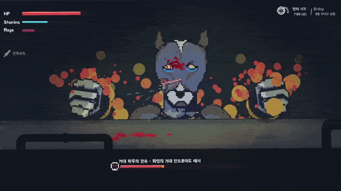

# Project-wak

스케일도 크게 제작했고 퀄리티도 좋고 비주얼도 굉장히 좋은거 같아서 개인적으로 젤 맘에 드는 프로젝트

유튜버 '우왁굳' 팬게임으로 제작함

1인 개발로 만들었고, 음악 빼고 그림부터 코드까지 싹다 혼자 작업함;;

완성 하기 전에 대략 100명 정도의 테스터들한테 베타테스트를 진행했음.

플레이 해본 사람들 말로는 팬게임 수준을 넘어서 스팀 판매해도 되는 급 정도라고 해주심 (감사합니다 :D)

(코드 관련 설명글은 아래 참고)

- 코드 관련 설명글

================================================================

- 보스 움직임은 다른 프로그램 이용 안하고 전부 코드로 일일히 짰습니다.

[관련 코드내용은 Object파일 -> (보스 이름 ex. obj_wak_doo)파일 참고해주세요]

https://github.com/ABER1047/Project-wak/tree/main/objects/obj_worm

================================================================

- 레이지 모드 준비 상태때 나오는 아우라, 혹은 불 이펙트의 외각선 효과도 마찬가지로 일일히 코드로 짜줬습니다.

전체적인 알고리즘은 다음과 같습니다.

1. 테두리 부분의 색을 딴 원을 하나 그림

2. 그 원위에 살짝 x픽셀 만큼 작은 원을 하나 덮어씌워서 더그림 (이때 x값은 미지수)

[관련 코드 내용은 Object및 script파일 -> "set_surf_outline" 및 "obj_camera", "code", "code_bubble_surf" 참고]

https://github.com/ABER1047/Project-wak/blob/main/scripts/set_surf_outline/set_surf_outline.gml

https://github.com/ABER1047/Project-wak/blob/main/objects/code_bubble_surf/Draw_0.gml

================================================================

- 빗물 튀기는 효과 및 스파크 튀기는 효과 또한 일일히 코드로 짜줬습니다.

전체적인 알고리즘은 다음과 같습니다.

1. 현재 좌표값 (x1,y1)와 1프레임 이후의 현재 좌표값 (x2,y2)의 값을 통해 해당 사이를 잇는 선을 x 픽셀 두깨로 하나 그리기 (이때 x값은 미지수)

2. (x2,y2)좌표값을 기준으로 (x1,y1)좌표값에서 x좌표 y좌표 각각 z만큼 x2,y2값에 가까워지도록 좌표값을 빼거나 더해줌 (이때 z값은 for문을 통해 제어함)

3. 이제 2번 단계에서 구해진 수많은 새로운 좌표값을 (x2,y2)좌표값과 연결하여 선을 그려줌

4. 각 선들의 투명도를 대략 0.05정도로 설정하면 (x2,y2)에 선들이 가까워질수록 색이 더 진해짐으로써 선이 자연스러워보임

[관련 코드 내용은 "effect_spark" 참고]

https://github.com/ABER1047/Project-wak/tree/main/objects/effect_spark

================================================================

- 화면 흔들림 효과

전체적인 알고리즘은 obj_camera에서의 "shake"라는 단어가 포함되어있는 변수들을 확인해주세요

[관련 코드 내용은 "obj_camera" 참고]

https://github.com/ABER1047/Project-wak/blob/main/objects/obj_camera/Step_0.gml

================================================================

- 레이저
- 
전체적인 알고리즘은 다음과 같습니다.

1. 최적화를 위해 레이저가 최대로 뻗어나갈 수 있는 거리에 제한을 둠 (아마 인게임에선 2500정도로 제한을 뒀음)

2. 레이저가 발사되는 지점 (x1,y1)을 기준으로 특정 발사 각도로 쭉 플레이어나 바닥에 닿거나 최대 거리로 뻗어나갈 때까지 반복문으로 체크

3. 플레이어나 바닥에 닿았거나, 최대 거리까지 뻗어나간 경우 반복문 빠져나오기

4. 반복문을 빠져나온 순간에서의 좌푯값 (x2,y2)까지 선을 이어줌 (해당 선이 레이저)

[관련 코드 내용은 "block_laser" 참고]

https://github.com/ABER1047/Project-wak/blob/main/objects/block_laser/Step_0.gml

================================================================

이외에 궁금한거 있으시면 디코로 연락해주심 자세히 설명드리겠읍니당 (디코 아이디는 제 깃헙 프로필에 적혀있어요!)
