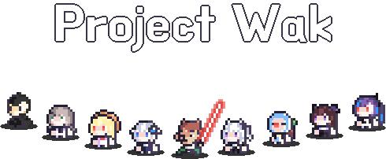
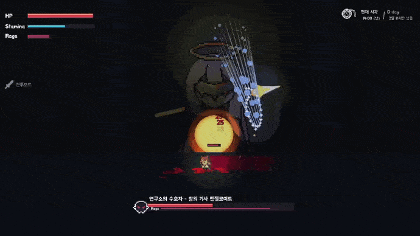
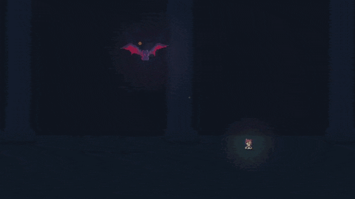
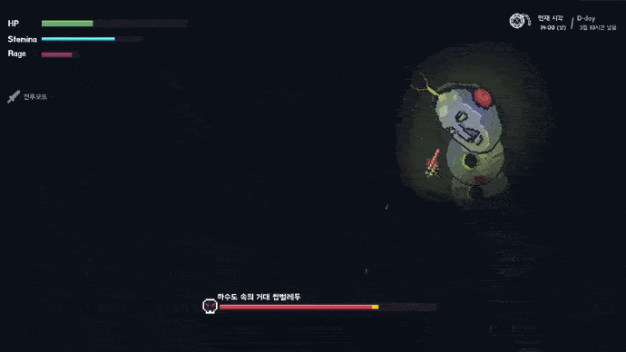

<div align="center">


</br></br>




#### - 총 다운로드 수


</br>

#### - 게임 다운로드 

[](https://github.com/ABER1047/Project-wak/releases/download/Alpha-1.1/project.wak_2022_12_28.zip)

</br></br>

#### - 디스코드

[](https://discord.gg/hzbCTRemqq)


</br></br></br></br></br></br>







#


스케일도 크게 제작했고 퀄리티도 좋고 비주얼도 굉장히 좋은거 같아서 개인적으로 젤 맘에 드는 프로젝트

유튜버 '우왁굳' 팬게임으로 제작함

1인 개발로 만들었고, 음악 빼고 그림부터 코드까지 싹다 혼자 작업함;;

완성 하기 전에 대략 100명 정도의 테스터들한테 베타테스트를 진행했음.

</br></br></br>

</div>


<details>
<summary>Credit (크레딧)</summary>

---------------------------------

#### 게임 시작시, 아래 명단에 기재된 분의 닉네임으로 이름을 설정하시면, 특수한 탈리스만을 획득할 수 있습니다
  
##### (기재된 분들 이외에 많은 분들이 테스트에 참여해주셨으며, 피드백 주신 분들만 선정해서 크레딧에 따로 기재했습니다)

</br></br>

- 1차 테스터 명단

StellarSea 서장님 오코츠유타 옥수수칲 탄창 황금뿌리 러머 Ssab 공벌 화염뽱어 젓가락아저씨 진성e 벼슬 페르마벤 댐쿵이 쓰레기맛캔디 1잡탕1 zun Dillionaire alpamin BackSang NANFREE 쥬기 참이프 광부 Contra QuiettBee 사미니

</br></br>

- 2차 테스터 명단

댐쿵이 BackSang 모니타리 스즈메의 문단속 벤찌 별명1577 Kastle 고 라니임니다 재영이요 윤석 러머 최민우 ㅁㅈ 허미온 아리에스 NAㅅ Mang0_k Ladon TJD ajdkg296 쥬기 잠복근무 도트박스 재영 윤석 허미온 cccc 원시인 징버거의 돗대 면주바이

</br></br>

- 3차 테스터 명단

세구세구세구야사랑해 1잡탕1 백상 KIM DDi YOMG TT1 ACHI99 Nikemach damku1214 Dillionaire 로얄플러쉬 DO_S 이미지박스 킹츄러스 seesaw 소다쿤 플로토돔 펭구 입꼬기 명준 갱후니 조금하는바드 은색의하늘 ajdkg296 ChungYeo sda justahirman 허거덩 Eluhu libertad

</br></br>

- Special Thanks

BackSang 쓰레기맛캔디 zun 왁만치 NANFREE alpamin 1잡탕1 쥬기 댐쿵이 ㅇㅅㄹㅋ Eluhu seesaw 뱌밍 우소 libertad 랑 이 갱후니 러머 ajdkg296 Hermione 대충지은닉네임

</br></br>

#### (이외의 후원자 분들은 따로 스폰서로써 기재해드리며 추가적인 특수 아이템을 획득 하실 수 있습니다! 후원 해주셔서 정말 감사합니다!)


---------------------------------

</details>


</br></br></br>


##### (코드 관련 설명글은 아래 참고)


<details>
<summary>코드 관련 설명글</summary>

</br>


<details>
<summary>여러 보스 모션</summary>


-------------

보스 움직임은 다른 프로그램 이용 안하고 전부 코드로 일일히 짰습니다.

[관련 코드내용은 Object파일 -> (보스 이름 ex. obj_wak_doo)파일 참고해주세요]

https://github.com/ABER1047/Project-wak/tree/main/objects/obj_worm
</br>

-------------
</details>


<details>
<summary>쌉벌레두</summary>

### - 쌉벌레두 (테라리아식 지렁이 알고리즘)

-------------


[관련 코드 내용은 해당 소스 파일 참고해주세요]

https://github.com/ABER1047/Worm

-------------
</details>

  
  
  
  
<details>
<summary>세이브 파일 암호화 알고리즘</summary>
  
  
### - 세이브 파일 암호화 알고리즘
-------------

바이트(Byte)의 특성을 이용해 암호화 하는 알고리즘

[관련 코드 내용은 해당 소스 파일 참고해주세요]

https://github.com/ABER1047/Project-wak/blob/main/scripts/ini_open_protect/ini_open_protect.gml

-------------
</details>


<details>
<summary>이펙트 외곽선 효과</summary>


### - 레이지 모드 준비 상태때 나오는 아우라, 혹은 불 이펙트의 외곽선 효과
-------------

전체적인 알고리즘은 다음과 같습니다.
```
1. 테두리 부분의 색을 딴 원을 하나 그림

2. 그 원위에 살짝 x픽셀 만큼 작은 원을 하나 덮어씌워서 더그림 (이때 x값은 미지수)
```

[관련 코드 내용은 Object및 script파일 -> "set_surf_outline" 및 "obj_camera", "code", "code_bubble_surf" 참고]

https://github.com/ABER1047/Project-wak/blob/main/scripts/set_surf_outline/set_surf_outline.gml

https://github.com/ABER1047/Project-wak/blob/main/objects/code_bubble_surf/Draw_0.gml

-------------
</details>


<details>
<summary>스파크/빗물 튀기기 효과</summary>

### ▼ 빗물 튀기는 효과 및 스파크 튀기는 효과
-------------

전체적인 알고리즘은 다음과 같습니다.
```
1. 현재 좌표값 (x1,y1)와 1프레임 이후의 현재 좌표값 (x2,y2)의 값을 통해 해당 사이를 잇는 선을 x 픽셀 두깨로 하나 그리기 (이때 x값은 미지수)

2. (x2,y2)좌표값을 기준으로 (x1,y1)좌표값에서 x좌표 y좌표 각각 z만큼 x2,y2값에 가까워지도록 좌표값을 빼거나 더해줌 (이때 z값은 for문을 통해 제어함)

3. 이제 2번 단계에서 구해진 수많은 새로운 좌표값을 (x2,y2)좌표값과 연결하여 선을 그려줌

4. 각 선들의 투명도를 대략 0.05정도로 설정하면 (x2,y2)에 선들이 가까워질수록 색이 더 진해짐으로써 선이 자연스러워보임
```

[관련 코드 내용은 "effect_spark" 참고]

https://github.com/ABER1047/Project-wak/tree/main/objects/effect_spark

-------------
</details>


<details>
<summary>화면 흔들림 효과</summary>


### - 화면 흔들림 효과
-------------

전체적인 알고리즘은 obj_camera에서의 "shake"라는 단어가 포함되어있는 변수들을 확인해주세요

[관련 코드 내용은 "obj_camera" 참고]

https://github.com/ABER1047/Project-wak/blob/main/objects/obj_camera/Step_0.gml

-------------
</details>


<details>
<summary>레이저 알고리즘</summary>

### - 레이저 (보스가 눈에서 발사하던 레이저 혹은 맵 중간중간 마다 놓여있던 장애물)
-------------

전체적인 알고리즘은 다음과 같습니다.
```
1. 최적화를 위해 레이저가 최대로 뻗어나갈 수 있는 거리에 제한을 둠 (아마 인게임에선 2500정도로 제한을 뒀음)

2. 레이저가 발사되는 지점 (x1,y1)을 기준으로 특정 발사 각도로 쭉 플레이어나 바닥에 닿거나 최대 거리로 뻗어나갈 때까지 반복문으로 체크

3. 플레이어나 바닥에 닿았거나, 최대 거리까지 뻗어나간 경우 반복문 빠져나오기

4. 반복문을 빠져나온 순간에서의 좌푯값 (x2,y2)까지 선을 이어줌 (해당 선이 레이저)
```

[관련 코드 내용은 "block_laser" 참고]

https://github.com/ABER1047/Project-wak/blob/main/objects/block_laser/Step_0.gml

-------------
</details>


</br></br></br></br></br>

#### 이외에 궁금한거 있으시면 디코로 연락해주심 자세히 설명드리겠읍니당

(디코 아이디는 제 깃헙 프로필에 적혀있어요!)


